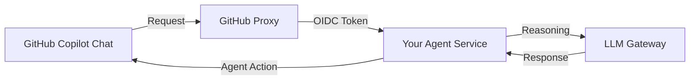

# Copilot Extensions: Building your Agentic Team
## Technical Specification by Kazi Musharraf

Copilot Extensions allow you to bridge external tools into the reasoning context of GitHub Copilot Chat. This guide details how to leverage and build extensions within the Spectrum Ecosystem.

---

## 🏛️ The Marketplace Spotlight (2025/2026)

The extension ecosystem has reached a level of "Universal Tooling" where almost every major DevSecOps platform has a native copilot.

### 1. Docker Extension
- **Interaction**: `@docker`
- **Capability**: Optimizes multi-stage builds and ensures security-hardened base images based on real-time vulnerability feeds.

### 2. Sentry Error-Context
- **Interaction**: `@sentry`
- **Capability**: Injects the last 10 error traces from production into the chat session. This allows Copilot to generate autonomous, verified bug fixes.

### 3. Stripe Payments Agent
- **Interaction**: `@stripe`
- **Capability**: High-fidelity integration of Stripe SDKs, checking for breaking API changes and ensuring PCI compliance in transactional logic.

---

## 🚀 Building a Custom Extension

Within the Spectrum Ecosystem, we build custom extensions to integrate our internal "Mural" design system tokens.

### 1. Extension Architecture
A Copilot Extension is essentially a web service that follows the GitHub Agent protocol.



### 2. The Semantic Bridge
Your agent should register "Functions" that Copilot can invoke.
- `GET_UI_TOKEN(pattern)`: Returns the appropriate CSS variable from the Mural design system.
- `VERIFY_AUDIT_POLICY(file)`: Runs a project-specific compliance check before the agent suggests a code block.

---

## 🛠️ Configuration and Deployment

Extensions are configured via a manifest file hosted on your service:

```json
{
  "name": "Mural Designer",
  "id": "mural-designer-v4",
  "description": "Aligns AI suggestions with the Kazi Musharraf Mural design system.",
  "agent": {
    "endpoint": "https://api.spectrum.hub/agent/mural",
    "capabilities": ["code_generation", "issue_analysis"]
  }
}
```

---
*Maintained by the Spectrum Ecosystem | 2026.4*
